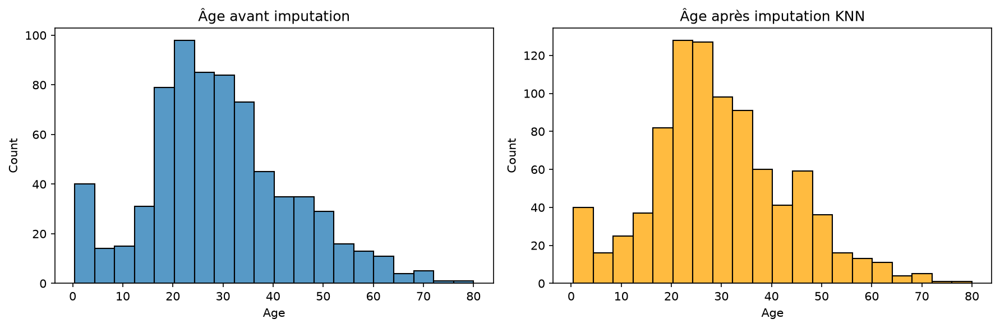
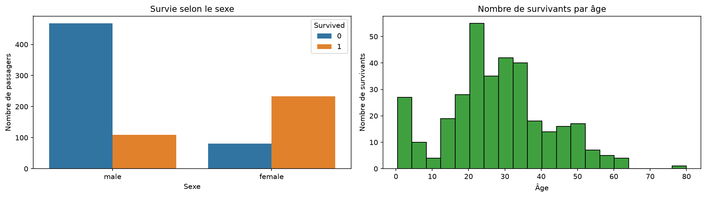
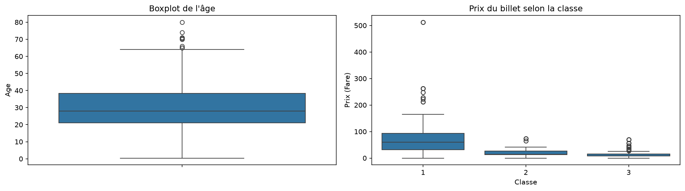

# 🚢 Titanic – Data Cleaning & Visualization

Exploratory analysis of the Titanic dataset: handling missing values (mode and KNN imputation), outlier detection and visualization of survival factors.

**Tools:** `Python` · `Pandas` · `Scikit-learn` · `Matplotlib` · `Seaborn`

---

## 📂 Project structure

```
├── titanic_analysis.py   # Full analysis script
├── titanic.csv           # Dataset
├── images/               # Generated charts
└── README.md
```

---

## 🧹 1. Handling missing values

| Column | Problem | Solution |
|---|---|---|
| `Embarked` | A few missing values | Replaced with the most frequent port (mode) |
| `Age` | Many missing values | **KNN imputation** (k = 5) based on class, sex, fare, family and port |
| `Cabin` | Mostly empty | Column dropped |

Before applying KNN, categorical variables were encoded (`LabelEncoder`) and all features were standardized (`StandardScaler`), since KNN relies on distances.



*The age distribution keeps the same overall shape after imputation, which shows the KNN did not distort the data.*

---

## 📊 2. Survival analysis



- **Left:** women survived in much greater proportion than men, consistent with the "women and children first" rule.
- **Right:** age distribution of survivors.

---

## 📦 3. Outlier detection



- **Age:** 25% of passengers are under 21, the median is 28 and 75% are under 38. Points beyond the whiskers are older passengers.
- **Fare by class:** fares are much higher and more spread out in 1st class, with some extreme values.

---

## ▶️ Run the project

```bash
pip install pandas scikit-learn matplotlib seaborn
python titanic_analysis.py
```
